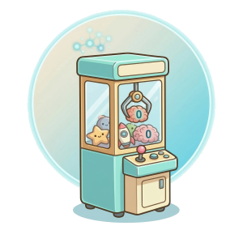
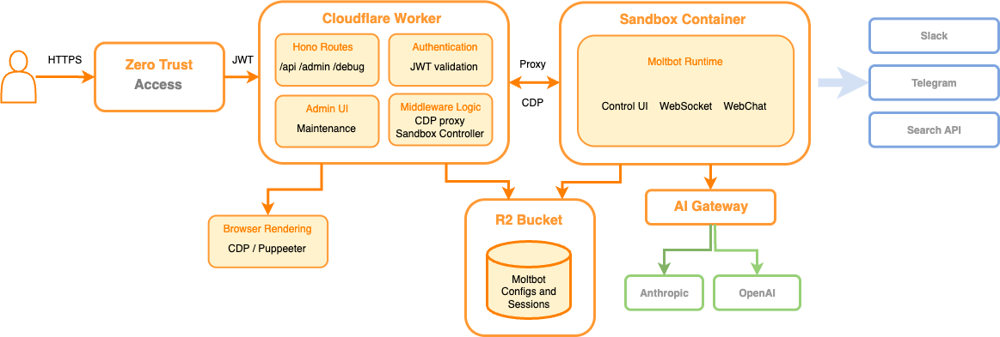

# ZeroClaw on Cloudflare Workers

Your own personal AI assistant — always on, fully private, running 24/7 in the cloud for **~$6–8/month**. No dedicated hardware. No Mac Mini. No server closet.



> **Experimental:** Proof of concept. Works, but not officially supported — may break without notice.

[](https://deploy.workers.cloudflare.com/?url=https://github.com/cloudflare/moltworker-zero)

---

## The Problem

Running a personal AI assistant that's always available — one that knows your context, connects to your chat platforms, and responds instantly — traditionally means dedicating hardware to it. A Mac Mini ($599+), a home server, or a beefy cloud VM. It sits there burning power and money whether you're using it or not.

## The Solution

[ZeroClaw](https://github.com/zeroclaw-labs/zeroclaw) is a personal AI assistant built in Rust that runs in **under 5 MB of memory** and boots in **under 10 milliseconds**. This project deploys it to [Cloudflare's cloud infrastructure](https://developers.cloudflare.com/sandbox/) where it costs a fraction of what dedicated hardware would.

**The math:**

| Approach | Upfront Cost | Monthly Cost | Always On? |
|----------|-------------|-------------|------------|
| Mac Mini at home | $599+ | ~$5–10 electricity | Yes, but tied to your home network |
| Cloud VM (e.g. AWS/GCP) | $0 | $20–50+ | Yes |
| **ZeroClaw on Cloudflare** | **$0** | **~$6–8** | **Yes, from anywhere** |

You get a personal assistant that's reachable from any device, on any network, with no hardware to maintain — for less than a streaming subscription.

---

## What You Get

- **Web chat interface** — Talk to your assistant from any browser, anywhere
- **Multi-platform** — Connect it to Telegram, Discord, or Slack — it meets you where you already are
- **Always available** — Runs 24/7 in the cloud; sleeps when idle and wakes instantly when you need it
- **Private and secure** — You own it. New devices must be manually approved before they can connect
- **Persistent memory** — Conversations and context carry across sessions
- **Browser automation** — Your assistant can browse the web, take screenshots, and act on your behalf
- **Extensible** — Add new capabilities through a swappable skills and tools system
- **No lock-in** — Works with Claude, GPT, Llama, Groq, or any OpenAI-compatible provider

---

## Why It's So Cheap

Most personal AI assistants are built with Node.js or Python runtimes that need gigabytes of memory just to sit idle. That means you need expensive containers or dedicated hardware.

ZeroClaw is different. It's a single Rust binary — no runtime overhead, no dependency bloat. It uses **200x less memory** than typical alternatives, which means it runs on Cloudflare's smallest, cheapest container tier.

| | Traditional Assistants | ZeroClaw |
|---|---|---|
| **Memory needed** | 1+ GB | <5 MB |
| **Cold start** | 1–2 minutes | <10 milliseconds |
| **Container tier** | Standard ($30+/mo) | Lite ($6–8/mo) |
| **Sleep penalty** | Minutes to wake up | Imperceptible |

That last point matters: because ZeroClaw wakes up instantly, you can set it to **sleep when idle** and only pay for the time you actually use it. No penalty, no waiting. A container that only runs 4 hours a day drops below **$6/month**.

<details>
<summary>Detailed cost breakdown</summary>

Using a `lite` container (256 MiB memory) — more than enough for ZeroClaw's <5 MB footprint:

| Resource | Approx. Monthly Cost |
|----------|---------------------|
| Memory (256 MiB provisioned) | ~$1.50 |
| CPU (at ~5% utilization) | ~$1 |
| Disk | ~$0.50 |
| Workers Paid plan | $5 |
| **Total** | **~$8/mo** |

CPU is billed on actual usage, not provisioned capacity. Memory and disk are billed while the container is running.

See [Cloudflare Containers pricing](https://developers.cloudflare.com/containers/pricing/) for full details.

</details>

<details>
<summary>How ZeroClaw compares to other assistant runtimes</summary>

Local machine benchmark (macOS arm64, Feb 2026), normalized for 0.8 GHz edge hardware:

| | OpenClaw | NanoBot | PicoClaw | **ZeroClaw** |
|---|---|---|---|---|
| Language | TypeScript | Python | Go | **Rust** |
| RAM | >1 GB | >100 MB | <10 MB | **<5 MB** |
| Startup (0.8GHz) | >500s | >30s | <1s | **<10ms** |
| Binary size | ~28 MB (dist) | N/A (scripts) | ~8 MB | **~8.8 MB** |
| Min. hardware cost | $599 | ~$50 | ~$10 | **~$10** |

</details>

The Cloudflare features used by this project — Access (authentication), Browser Rendering, AI Gateway, and R2 Storage — all have **free tiers**.

---

## Architecture



This project builds on the [OpenClaw-on-Cloudflare](https://github.com/cloudflare/moltworker) architecture (formerly Moltbot/Clawdbot) — same gateway pattern, same Cloudflare integration, same device pairing and auth model. ZeroClaw replaces the runtime with a lean Rust binary while keeping everything else identical.

---

## Getting Started

### What You'll Need

- A [Cloudflare Workers Paid plan](https://www.cloudflare.com/plans/developer-platform/) ($5/month)
- An [Anthropic API key](https://console.anthropic.com/) for Claude access (or see [AI Gateway](#recommended-cloudflare-ai-gateway) for other providers)
- Node.js installed on your computer
- Basic comfort with a terminal/command line

### Step 1: Deploy the Worker

```bash
# Install project dependencies
npm install

# Store your Anthropic API key securely in Cloudflare
npx wrangler secret put ANTHROPIC_API_KEY

# Generate a secure access token for your assistant's web interface
# ⚠️ Save this token somewhere safe — you'll need it to log in
export MOLTBOT_GATEWAY_TOKEN=$(openssl rand -hex 32)
echo "Your gateway token: $MOLTBOT_GATEWAY_TOKEN"
echo "$MOLTBOT_GATEWAY_TOKEN" | npx wrangler secret put MOLTBOT_GATEWAY_TOKEN

# Deploy to Cloudflare
npm run deploy
```

### Step 2: Open the Chat Interface

Visit your new assistant at:

```
https://your-worker.workers.dev/?token=YOUR_GATEWAY_TOKEN
```

Replace `your-worker` with your actual worker name and `YOUR_GATEWAY_TOKEN` with the token from Step 1.

> First load is near-instant — no multi-minute cold start.

### Step 3: Set Up Admin Access

**You can't chat yet** — first you need to protect the admin panel and approve your device.

1. **Enable Cloudflare Access** (adds login protection to your admin panel):
   - Go to your [Workers dashboard](https://dash.cloudflare.com/?to=/:account/workers-and-pages)
   - Select your worker → **Settings** → **Domains & Routes**
   - In the `workers.dev` row, click `...` → **Enable Cloudflare Access**
   - Note the **AUD tag** shown in the dialog
   - Go to **Zero Trust** → **Access** → **Applications**, find your worker, and add your email to the allow list

2. **Tell your worker about the Access setup:**

   ```bash
   # Your Cloudflare Access team domain (e.g., "myteam.cloudflareaccess.com")
   npx wrangler secret put CF_ACCESS_TEAM_DOMAIN

   # The AUD tag you copied above
   npx wrangler secret put CF_ACCESS_AUD
   ```

3. **Redeploy** so the changes take effect:

   ```bash
   npm run deploy
   ```

### Step 4: Pair Your Device

1. Visit `/_admin/` on your worker URL — you'll log in via Cloudflare Access
2. Open the chat interface in another tab (with your `?token=`)
3. In the admin panel, your device appears as "pending" — click **Approve**
4. Done. Your device can now chat freely with your assistant

---

## Recommended: Enable Persistent Storage

Without this, your conversation history and paired devices are **lost every time the container restarts**. Since ZeroClaw's fast restarts make aggressive sleep timeouts practical, you'll want R2 storage so your data survives.

### 1. Create an R2 API Token

- Go to **R2** → **Overview** in your [Cloudflare Dashboard](https://dash.cloudflare.com/)
- Click **Manage R2 API Tokens** → create a new token with **Read & Write** permissions
- Scope it to the `moltbot-data` bucket (created automatically on first deploy)
- Copy the **Access Key ID** and **Secret Access Key**

### 2. Store the Credentials

```bash
npx wrangler secret put R2_ACCESS_KEY_ID
npx wrangler secret put R2_SECRET_ACCESS_KEY
npx wrangler secret put CF_ACCOUNT_ID
```

> **Finding your Account ID:** In the [Cloudflare Dashboard](https://dash.cloudflare.com/), click the three-dot menu next to your account name → "Copy Account ID."

### How It Works

- On startup, the container restores your data from R2
- Every 5 minutes, it backs up automatically
- You can trigger a manual backup anytime from the admin panel at `/_admin/`

---

## Optional: Connect Chat Platforms

Your assistant can live wherever you already chat.

**Telegram:**
```bash
npx wrangler secret put TELEGRAM_BOT_TOKEN
npm run deploy
```

**Discord:**
```bash
npx wrangler secret put DISCORD_BOT_TOKEN
npm run deploy
```

**Slack:**
```bash
npx wrangler secret put SLACK_BOT_TOKEN
npx wrangler secret put SLACK_APP_TOKEN
npm run deploy
```

Each platform uses device pairing by default — new DM conversations need your approval in the admin panel before the assistant will respond.

## Recommended: Cloudflare AI Gateway

[AI Gateway](https://developers.cloudflare.com/ai-gateway/) sits between your assistant and the AI provider. It gives you caching, rate limiting, analytics, and cost tracking — useful for keeping tabs on your API spend.

```bash
# Your AI provider's API key (e.g., Anthropic key)
npx wrangler secret put CLOUDFLARE_AI_GATEWAY_API_KEY

# Your Cloudflare account ID
npx wrangler secret put CF_AI_GATEWAY_ACCOUNT_ID

# Your AI Gateway ID (from the gateway dashboard)
npx wrangler secret put CF_AI_GATEWAY_GATEWAY_ID

npm run deploy
```

When AI Gateway is configured, it takes priority over a direct `ANTHROPIC_API_KEY`.

<details>
<summary>Using a different AI model or provider</summary>

By default, AI Gateway uses Claude Sonnet 4.5. To change it:

```bash
npx wrangler secret put CF_AI_GATEWAY_MODEL
# Format: provider/model-id
```

Examples:

| Provider | Value |
|----------|-------|
| Workers AI | `workers-ai/@cf/meta/llama-3.3-70b-instruct-fp8-fast` |
| OpenAI | `openai/gpt-4o` |
| Anthropic | `anthropic/claude-sonnet-4-5` |
| Groq | `groq/llama-3.3-70b` |

The API key must match the provider. One provider at a time through the gateway.

With [Unified Billing](https://developers.cloudflare.com/ai-gateway/features/unified-billing/), Workers AI models can be billed directly through Cloudflare — no separate provider key needed.

</details>

---

## Managing Your Assistant

### Sleep Settings (Save Money)

Because ZeroClaw wakes up in milliseconds, you can aggressively sleep the container without any real penalty:

```bash
npx wrangler secret put SANDBOX_SLEEP_AFTER
# Enter a duration like: 5m, 10m, or 30m
```

With R2 storage enabled, your data survives restarts. Short sleep timeout + R2 persistence = lowest possible cost with zero friction.

### Admin Panel (`/_admin/`)

From the admin panel you can:

- See R2 storage status and trigger manual backups
- Restart the assistant's gateway process
- Approve or manage paired devices

### Debug Endpoints

For troubleshooting, enable debug routes:

```bash
npx wrangler secret put DEBUG_ROUTES
# Enter: true
```

Then access:
- `/debug/processes` — Running processes
- `/debug/logs?id=<process_id>` — Process logs
- `/debug/version` — Version info

---

## Security

Your assistant is protected by three layers, plus ZeroClaw's own built-in protections:

| Layer | What It Does |
|-------|-------------|
| **Cloudflare Access** | Requires login (email, Google, GitHub, etc.) for admin routes |
| **Gateway Token** | A secret URL parameter needed to reach the chat interface |
| **Device Pairing** | Every new device must be manually approved before it can interact |
| **ZeroClaw Runtime** | Strict sandboxing, explicit allowlists, and workspace scoping built in |

All four work together. Even with a valid token, a new device still needs your manual approval.

---

## All Configuration Options

<details>
<summary>Click to expand the full secrets reference</summary>

### Required (pick one AI provider setup)

| Secret | Description |
|--------|-------------|
| `ANTHROPIC_API_KEY` | Direct Anthropic API key |
| — *or* — | |
| `CLOUDFLARE_AI_GATEWAY_API_KEY` | AI provider key routed through AI Gateway |
| `CF_AI_GATEWAY_ACCOUNT_ID` | Cloudflare account ID (for gateway URL) |
| `CF_AI_GATEWAY_GATEWAY_ID` | AI Gateway ID (for gateway URL) |

### Required for full functionality

| Secret | Description |
|--------|-------------|
| `MOLTBOT_GATEWAY_TOKEN` | Access token for the web chat interface |
| `CF_ACCESS_TEAM_DOMAIN` | Cloudflare Access team domain (for admin panel) |
| `CF_ACCESS_AUD` | Cloudflare Access audience tag (for admin panel) |

### Persistent storage (recommended)

| Secret | Description |
|--------|-------------|
| `R2_ACCESS_KEY_ID` | R2 access key |
| `R2_SECRET_ACCESS_KEY` | R2 secret key |
| `CF_ACCOUNT_ID` | Cloudflare account ID |

### Chat platforms (optional)

| Secret | Description |
|--------|-------------|
| `TELEGRAM_BOT_TOKEN` | Telegram bot token |
| `TELEGRAM_DM_POLICY` | `pairing` (default) or `open` |
| `DISCORD_BOT_TOKEN` | Discord bot token |
| `DISCORD_DM_POLICY` | `pairing` (default) or `open` |
| `SLACK_BOT_TOKEN` | Slack bot token |
| `SLACK_APP_TOKEN` | Slack app token |

### Browser automation (optional)

| Secret | Description |
|--------|-------------|
| `CDP_SECRET` | Shared secret for browser automation |
| `WORKER_URL` | Public URL of your worker |

### Other

| Secret | Description |
|--------|-------------|
| `CF_AI_GATEWAY_MODEL` | Override AI model (`provider/model-id`) |
| `ANTHROPIC_BASE_URL` | Custom Anthropic API base URL |
| `OPENAI_API_KEY` | OpenAI API key (alternative provider) |
| `DEV_MODE` | `true` to skip auth (local development only) |
| `DEBUG_ROUTES` | `true` to enable `/debug/*` endpoints |
| `SANDBOX_SLEEP_AFTER` | Sleep timeout: `never` (default), `10m`, `1h`, etc. |

</details>

---

## Troubleshooting

| Problem | Solution |
|---------|----------|
| `npm run dev` gives "Unauthorized" | Enable Containers in your [Cloudflare dashboard](https://dash.cloudflare.com/?to=/:account/workers/containers) |
| Gateway won't start | Run `npx wrangler secret list` to verify secrets, then `npx wrangler tail` for logs |
| Config changes not taking effect | Edit the `# Build cache bust:` comment in the Dockerfile and redeploy |
| R2 storage not working | Verify all three secrets are set (`R2_ACCESS_KEY_ID`, `R2_SECRET_ACCESS_KEY`, `CF_ACCOUNT_ID`). R2 only works in production, not local dev |
| Admin panel access denied | Check that `CF_ACCESS_TEAM_DOMAIN` and `CF_ACCESS_AUD` are set correctly |
| Devices not showing in admin | Device listing takes 10–15 seconds due to WebSocket overhead — wait and refresh |
| WebSocket issues in local dev | Known limitation with `wrangler dev`. Deploy to Cloudflare for full functionality |

### Windows Users

Git may check out shell scripts with Windows-style line endings (CRLF), which breaks the Linux container. Fix with:

```bash
git config --global core.autocrlf input
```

See [#64](https://github.com/cloudflare/moltworker/issues/64) for details.

---

## Local Development

Create a `.dev.vars` file:

```bash
DEV_MODE=true         # Skips Cloudflare Access auth and device pairing
DEBUG_ROUTES=true     # Enables /debug/* endpoints
```

---

## Acknowledgments

This project stands on the shoulders of some excellent open source work:

- **[ZeroClaw](https://github.com/zeroclaw-labs/zeroclaw)** by [ZeroClaw Labs](https://github.com/zeroclaw-labs) — The blazing-fast Rust runtime that makes this whole thing possible. Built by [@theonlyhennygod](https://github.com/theonlyhennygod) and [27+ contributors](https://github.com/zeroclaw-labs/zeroclaw/graphs/contributors).
- **[OpenClaw](https://github.com/openclaw/openclaw)** — The original multi-channel AI gateway (formerly Moltbot / Clawdbot) that pioneered the architecture pattern: one assistant, many platforms. The gateway design, device pairing model, and chat platform integrations all trace back to this project and its [contributors](https://github.com/openclaw/openclaw/graphs/contributors).
- **[Cloudflare](https://github.com/cloudflare/moltworker)** — The original `moltworker` deployment wrapper that this repo was forked from, plus the [Sandbox](https://developers.cloudflare.com/sandbox/), [AI Gateway](https://developers.cloudflare.com/ai-gateway/), and [R2](https://developers.cloudflare.com/r2/) infrastructure that makes the ~$6/month price tag real.

If you find this project useful, go star the upstream repos too — they did the hard part. ⭐

---

## Links

- [ZeroClaw](https://github.com/zeroclaw-labs/zeroclaw) — The Rust-based AI assistant runtime
- [OpenClaw](https://github.com/openclaw/openclaw) — The original TypeScript-based assistant this architecture builds on
- [Cloudflare Sandbox Docs](https://developers.cloudflare.com/sandbox/) — Container hosting
- [Cloudflare Access Docs](https://developers.cloudflare.com/cloudflare-one/policies/access/) — Authentication